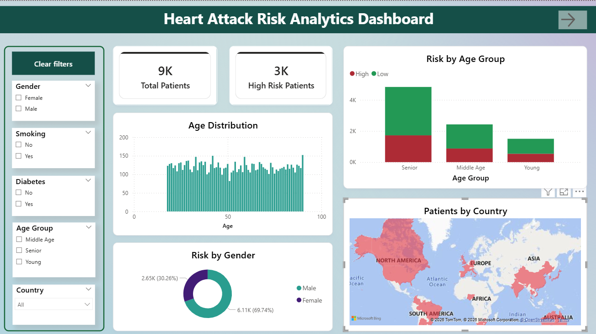
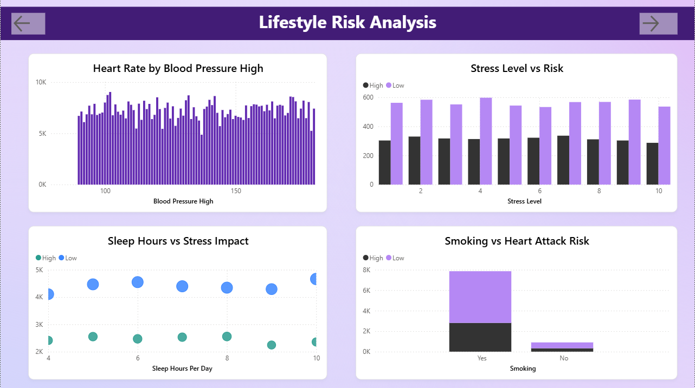
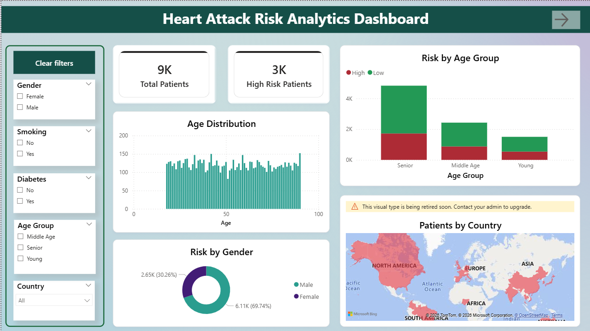

# Heart Attack Risk Analysis Dashboard

## Overview

The **Heart Attack Risk Analysis Dashboard** is a data analytics project built using **Power BI** to analyze patient health data and identify factors that influence heart attack risk.
The dashboard transforms complex medical datasets into interactive visualizations that help understand relationships between lifestyle habits, medical conditions, and heart attack probability.

This project demonstrates how **data visualization and analytics** can be used to extract meaningful insights from healthcare datasets.

---

## Dataset

The dataset used in this project is the **Heart Attack Prediction Dataset** obtained from Kaggle.

Dataset Link:
https://www.kaggle.com/datasets/iamsouravbanerjee/heart-attack-prediction-dataset

### Dataset Features

The dataset includes multiple patient health attributes such as:

* Age
* Gender
* Country
* Cholesterol
* Blood Pressure
* BMI
* Heart Rate
* Smoking Habits
* Exercise Hours per Week
* Sleep Hours per Day
* Stress Level
* Diabetes Status
* Heart Attack Risk Indicator

These features are used to analyze how different health and lifestyle factors contribute to heart attack risk.

---

## Tools & Technologies Used

* Power BI Desktop
* DAX (Data Analysis Expressions)
* Data Visualization Techniques
* Microsoft Excel (for dataset preparation)

---

## Dashboard Features

The dashboard contains **three main analytical sections**:

### 1. Overview Dashboard

Provides general statistics about the dataset.

Visualizations include:

* Total Patients
* High Risk Patients
* Risk by Gender
* Risk by Age Group
* Age Distribution
* Patients by Country


This page provides a summary of patient statistics and demographic analysis including total patients, high risk patients, age distribution, and geographic distribution.


---


### 2. Lifestyle Risk Analysis

Analyzes how lifestyle habits affect heart attack risk.

Visualizations include:

* Smoking vs Heart Attack Risk
* Exercise Hours vs Risk
* Sleep Hours vs Stress Level
* Stress Level vs Risk

Key Insight:
Patients with **low physical activity, high stress levels, and smoking habits** show increased heart attack risk.

This page analyzes how lifestyle habits influence heart attack risk such as smoking habits, sleep hours, exercise activity, and stress levels.

---

### 3. Medical Risk Factors

Analyzes important medical indicators related to heart attack risk.

Visualizations include:

* Cholesterol vs Heart Rate (Scatter Plot)
* Blood Pressure Distribution (Histogram)
* BMI vs Heart Attack Risk

Key Insight:
Patients with **higher cholesterol levels, high blood pressure, and higher BMI** tend to show greater heart attack risk.

This page focuses on medical indicators such as cholesterol levels, blood pressure distribution, and BMI categories to identify patterns related to heart attack risk.


---

## Key Insights

* Smoking increases the likelihood of heart attack risk.
* Higher cholesterol levels are associated with increased heart disease risk.
* Lack of exercise correlates with higher health risks.
* Overweight and obese BMI categories show higher risk patterns.
* High stress levels also contribute to increased risk.

---

## Project Structure

```
Heart-Attack-Risk-Analytics-Dashboard
│
├── Internship
│   ├── daily practice
│   └── lecture work
│
├── Project
│   ├── Power BI file (.pbix)
│   ├── Dataset
│   └── PPT
│
└── README.md
```

---

## How to Use the Dashboard

1. Download the `.pbix` file from the repository.
2. Open the file using **Power BI Desktop**.
3. Explore the interactive dashboard using filters and slicers.
4. Analyze different health factors related to heart attack risk.

---

## Conclusion

The **Heart Attack Risk Analysis Dashboard** demonstrates how healthcare data can be analyzed using modern data visualization tools.
By converting complex datasets into interactive dashboards, the project helps identify patterns and relationships between medical conditions and heart attack risk.

This type of analytical dashboard can support **healthcare research, data-driven decision-making, and preventive health analysis**.

---

## Future Improvements

Possible future enhancements include:

* Integrating larger healthcare datasets
* Adding predictive analytics models
* Real-time health monitoring dashboards
* Web-based healthcare analytics platform
* Integration with hospital health records

---

## Author

Your Name
B.Tech – Artificial Intelligence & Data Science

---

## License

This project is for **educational and research purposes only**.
